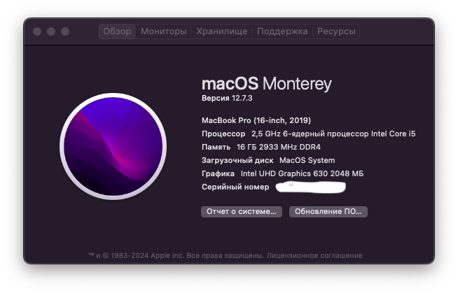

# EFI Mac OS Monterey for MSI GF75 Thin 10UC-048XRU 17.3" Gaming Laptop, i5-10300H, 16GB, 128GB SSD
 
MSI GF75 10SC OpenCore 0.9.2 Monterey 12.6

Guided by: https://dortania.github.io/OpenCore-Install-Guide/

**Configuration**

|  Configuration | Specifications	Detail | 
|--------------------|--------------------|
| Computer model  | MSI GF75 Thin 10UC-048XRU 17.3" (RTX 3050)  | 
| Processor  | Intel® Core™ i5-10500H @2.50Ghz  |
| Memory  | 16 GB DDR4 3200 Mhz (8+8)  |
| Disk  | M.2 PCIe SSD Kingston OM8PCP3512F 512GB  |
| Integrated Graphics  | Intel UHD Graphics 630  |
| Discrete Graphics  | NVIDIA GeForce RTX 3050 4GB  |
| Ethernet  | Realtek RTL8168H  |
| Display  | IPS FHD 1920x1080 (17.3 inch) @144Hz  |
| Sound Card  | Realtek Audio ALC233  |
| Wireless  | Intel® Wi-Fi 6 AX201  |
| Ethernet  | Realtek RTL8168H  |

# Change BIOS settings

- Show hidden settings with: CTRL Right + SHIFT Right + ALT Left + F2
- Turn off Secure Boot [Security]
- Turn off CFG Lock [Advanced -> Power & Performance -> CPU -> CPU Lock Configuration]
- Disable Fast Boot [Boot]
- Select UEFI mode without CSM [Boot]

# Works

- QE/CI Graphics Of iGPU Intel® UHD Graphics for 10th [Intel® UHD 630]
- CPU Power Management
- Restart, Sleep and Shutdown
- Realtek ALC233 Audio
- Trackpad with multi-touch gestures
- Battery status
- Bluetooth
- All USB Ports
- Function Key
- Brightness Button Up/Down
- Bluetooth Headset Mic
- Wifi
- HDMI video / audio
- iMessage
- Facetime

# Not Works
- AirDrop

# If applications crash with errors, follow these instructions to fix:

1. Open the terminal:

    ```Terminal
    sudo chmod -R 755 /Applications/SMDActivator.app 
    Enter administrator password: *********
    ```

2. Right-click on the application and select "Show Package Contents".

3. Navigate to the folder `/Applications/SMDActivator.app/Contents/MacOS/SMDActivator`.

4. Open the terminal again:

    ```Terminal
    sudo chmod -R 755 /Applications/SMDActivator.app/Contents/MacOS/SMDActivator
    Enter administrator password: *********
    ```

Now the application that was crashing with a memory error should be ready to use!

#If you're still experiencing issues with applications, particularly those related to memory access errors and notifications, the solution is straightforward.

  **Step 1**: Enter Recovery Mode.
  To enter Recovery Mode, restart your Mac and immediately press and hold `Command (⌘) + R` until you see the Apple logo or a spinning globe.

  **Step 2**: Select the option to install macOS Monterey.
  Note: These instructions are specific to macOS Monterey. Steps may vary for other versions of macOS.

  **Step 3**: Choose the disk where your current system is installed.

  **Step 4**: Wait for the installation to complete.
  This process will reinstall all system files while keeping your personal files and applications untouched.

  **Important**: Before proceeding with the reinstallation, ensure you have backed up your important data to avoid any potential data loss.

  After reinstalling macOS, check for updates under `System Preferences` -> `Software Update` to ensure all components are up to date. If issues persist, consider reinstalling affected applications.


